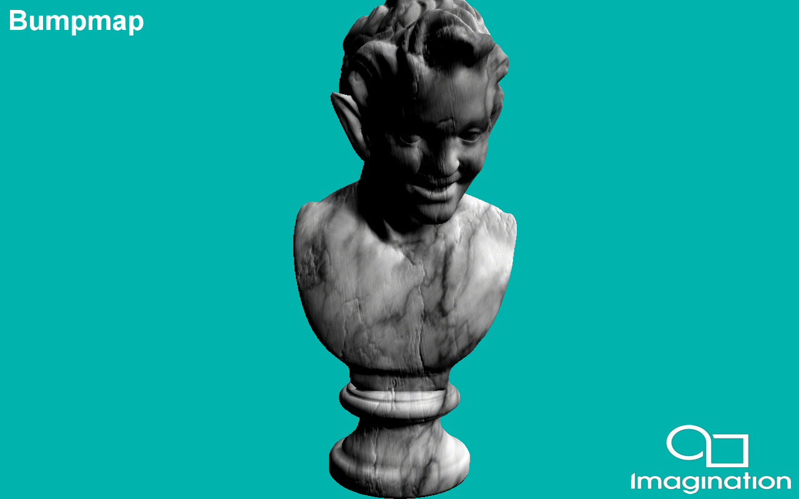

=======
Bumpmap
=======

This example demonstrates using a normal map to implement bumpmapping using the PowerVR Framework.

API
---
* OpenGL ES 3.0+

Description
-----------
Bumpmapping is a technique for simulating bumps and wrinkles on the surface of an object. This is achieved by perturbing the surface normals of the object and using the perturbed normal during the illumination calculations. The result is an apparently bumpy surface rather than a perfectly smooth surface, although the surface of the underlying object is not actually changed. 

This technique is used extensively in graphics applications to add perceived detail to models without adding further geometry, and could be considered the baseline for modern rendering.

Controls
--------
- Quit- Close the application

