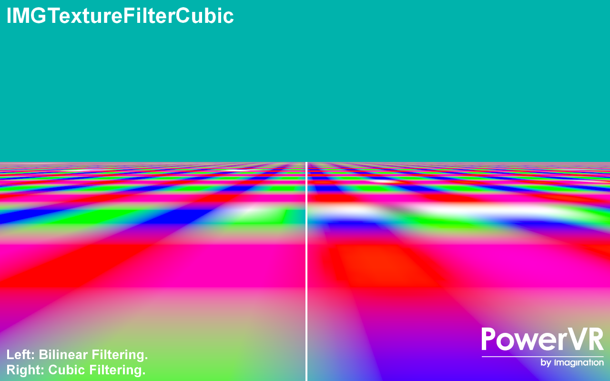

=====================
IMGTextureFilterCubic
=====================

This example demonstrates the advantages of using the extension ``GL_IMG_texture_filter_cubic`` for cubic texture filtering

Description
-----------
This example shows the advantages of using cubic texture filtering using the extension ``GL_IMG_texture_filter_cubic``. The left side of the image is rendered using traditional bilinear texture filtering with mipmapping. The right side of the image is rendered using cubic texture filtering.

APIs
----
* OpenGL ES 2.0+

Controls
--------
- Quit- Close the application