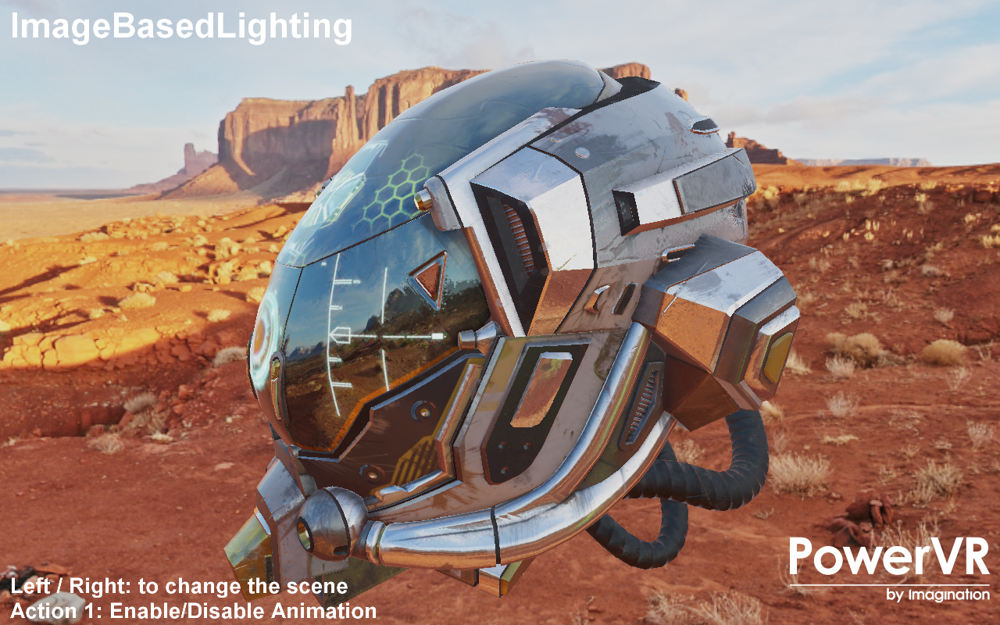

===================
ImageBasedLighting
===================

This example demonstrates Physically Based Rendering (PBR) with Image Based Lighting (IBL).

API
---
* OpenGL ES 3.1+

Description
-----------
This example has two scenes using Metallic-Roughness PBR workflow. It features two scenes, a GLTF model rederered  with  albedo, metallic roughness and emissive map, and a collection of spheres showcasing different metallic and non metallic non-texture values.
The examples uses a Diffuse map pre-computed offline from the environment map, using the lambert diffuse BRDF, and two specular maps (also calculated offline): A Pre-Filtered Environment map for different roughness values, and an Environment BRDF including the rest of the equation.

.. figure:: ./IBL_layers.png

Controls
--------
- Quit- Close the application
- Left/Right to change the scene
- Action1 to pause.
