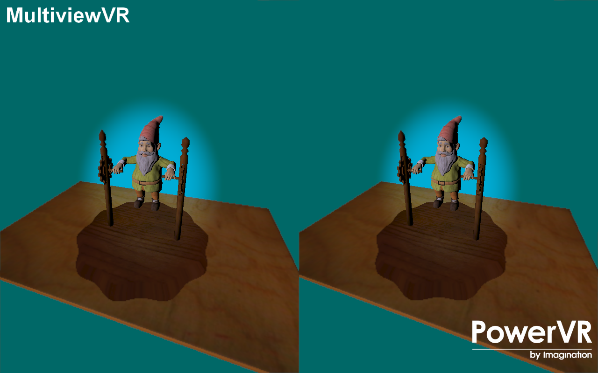

===========
MultiviewVR
===========

Render a scene stereoscopically intended for VR hardware it using the GL_OVR_multiview extension.

Description
-----------
This training course introduces the GL_OVR_multiview extension, and shows how to use the extension to render the scene from two different eye locations.
Additionally, two sets of FBOs are being used (one low and one high resolution), with the intent of rendering the center of the screen in high res, and
the edges of the screen (which will be distorted by the VR lenses anyway) in lower resolution. The end result is a split screen suitable for VR.

APIS
----
* OpenGL ES 3.0+

Controls
--------
- Quit- Close the application
