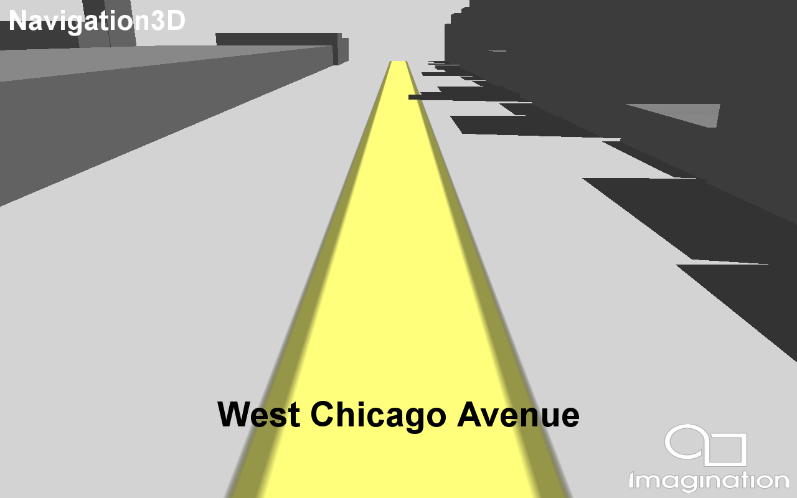

============
Navigation3D
============

Demonstrates parsing, processing and rendering of raw OSM data as a 3D navigational map.

Description
-----------	
The 3D navigation example demonstrates the entire process of creating a navigational map from raw XML data,
in this case the example is using Open Street Map data. The example demonstrates loading and parsing of the XML,
it also shows the processing of the raw data into render-able polygons which can be used by the GPU, this is 
achieved through triangulation which uses the ear clipping algorithm to generate triangles from lists of points.
This example also shows several rendering techniques such as; anti-aliased lines with GRLAA for road outlines, 
handling of UI elements for road names and places of interest, and an effective tile based approach to batching 
and culling the geometry. 

APIS
----
* OpenGL ES 2.0+, Vulkan

Controls
--------
Q- Quit- Close the application