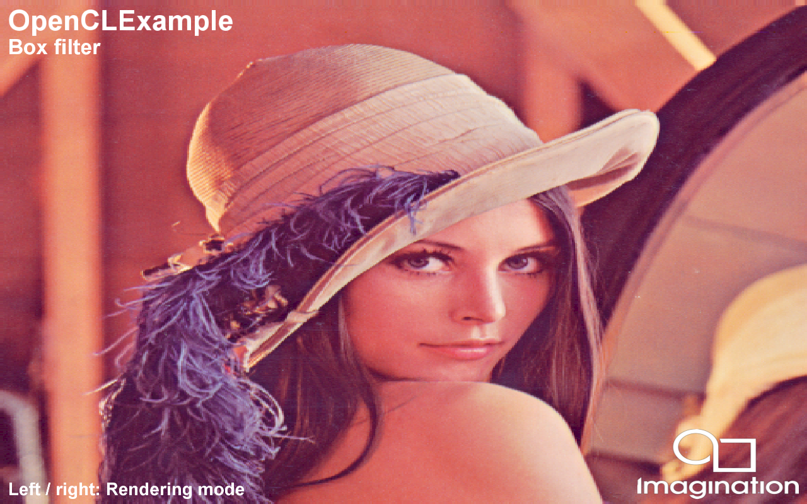

=============
OpenCLExample
=============

This example demonstrates using small image convolution OpenCL kernels.

Description
-----------
This example shows how to structure an application with OpenCL / OpenGL interoperability (or if necessary, CPU fallback) to process images on the GPU using OpenCL. 

Several 3x3 convolution filters are shown: 

* Gaussian Blur
* erode/dilate
* edge detection
* emboss

APIs
----
* OpenGL ES 2.0+ with OpenCL

Controls
--------
- Left/Right- Change the convolution filter
- Quit- Close the application