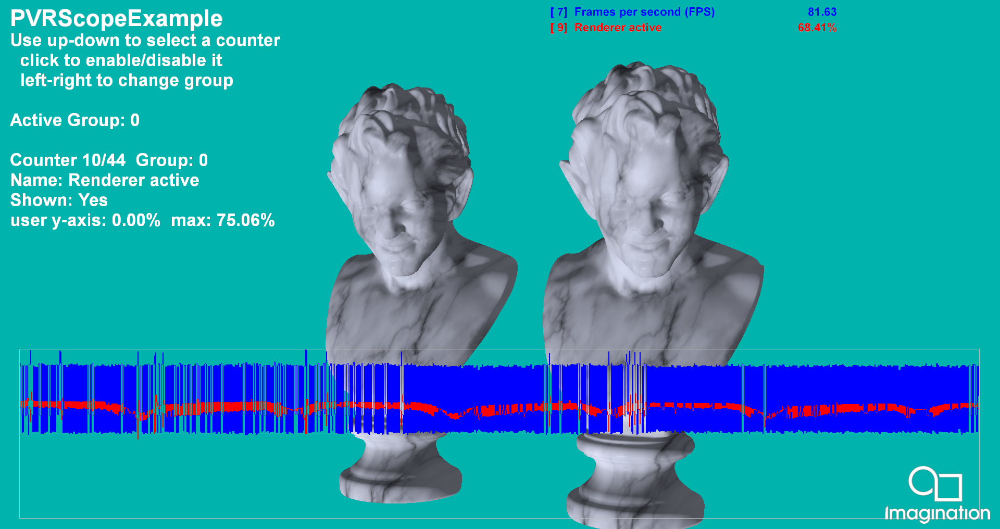

===============
PVRScopeExample
===============

Demonstrates the use of PVRScope and the example graphing code.

Description
-----------
This example uses a simple PBR-style shader, and shows the use of PVRScope to allow an application to return performance statistics from the GPU in real time. It uses the example graphing code to render a graph of the selected counters on the screen. For further details, refer to the PVRScope User Manual. 

APIs
----
* OpenGL ES 2.0+
* Vulkan

Controls
--------
- Quit- Close demo
- Up/Down- Select a counter from the available list of HW counters
- Action1- Add/remove selected counter to the graph