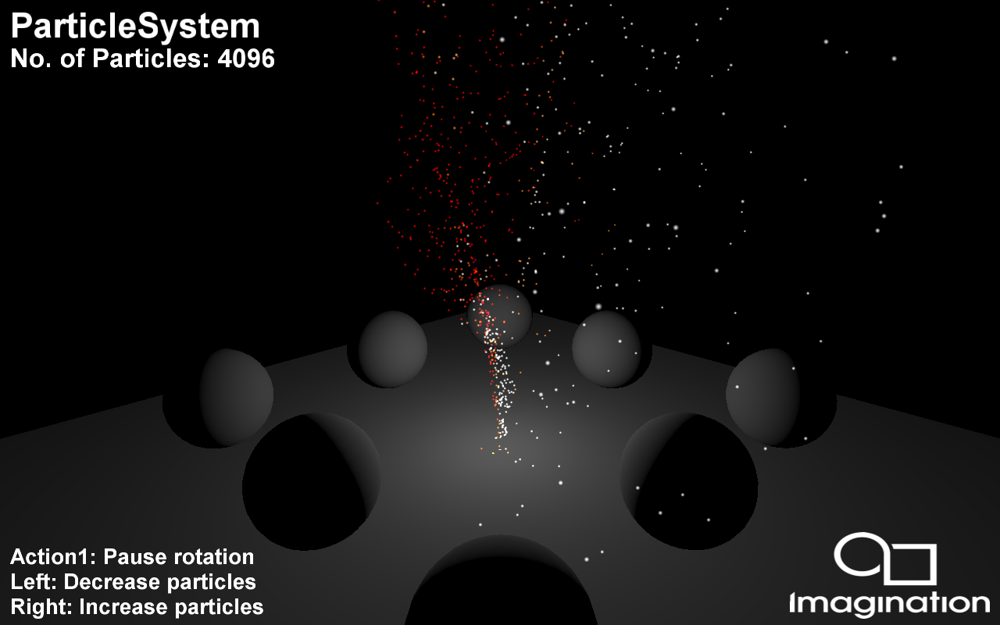

==============
ParticleSystem
==============

Shows how to implement a simple particle system using GPGPU.

Description
-----------
The demo utilises GPGPU (GPU Compute) to implement a particle system, a simple integration-based simulation which is advanced and then rendered every frame strictly on the GPU, without any CPU access of that data. Particle systems are techniques that use a large amount of sprites to simulate phenomena that would be difficult to reproduce with conventional rendering techniques. Furthermore, it also highlights the interaction between the Compute and the Rendering part of a simulation.
Requires OpenGL ES 3.1 or Vulkan capable platform.

APIS
----
* Vulkan
* OpenGL ES 3.1

Controls
--------
- Quit- Close demo
	- 	Left/Right- Decrease/increase number of particles
- Up/Down- Switch between GPU Compute and CPU Particle System implementation.