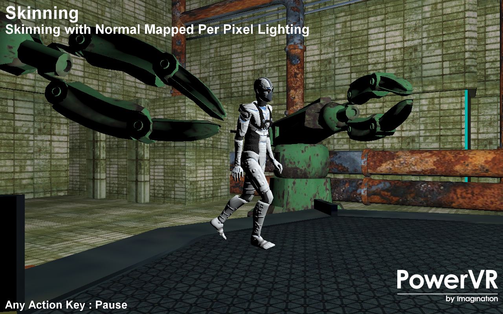

========
Skinning
========

This example shows a scene with a combination of a skinned, bumpmapped character with non-skinned, non-bumpmapped objects.

Description
-----------
Skinning is the act of animating a vertex over time given a set (palette) of matrices, and a known set of blend weights assigned to those matrices. 

The Skinning example shows a skinned character in combination with bump mapping. For each frame, the matrix palette is recomputed based on time. 

PVRAssets and POD files support skinning with either full transformation matrices, or Quaternion rotation with scaling and translation vectors. The provided POD file contains matrix animation. A shader storage buffer object is used to support a dynamic number of bones.

APIS
----
* OpenGL ES 3.0+
* Vulkan

Controls
--------
- Action1/2/3- Pause
- Esc- Close