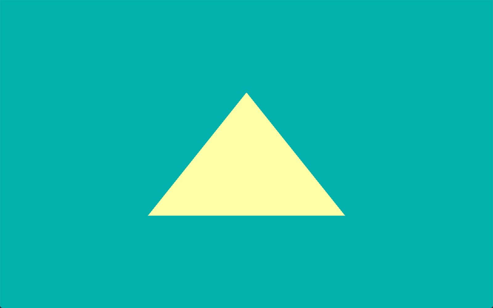

=========
Hello API
=========

This example shows how to draw a triangle using OpenGL ES Safety Critical API.

API
---

* OpenGL SC 2.0
* OpenGL ES 2.0

Description
-----------

The OpenGL ES Safety Critical API differs from the traditional OpenGL ES API in several aspects. This demo explains those differences showcasing through the process of drawing a triangle on screen.
