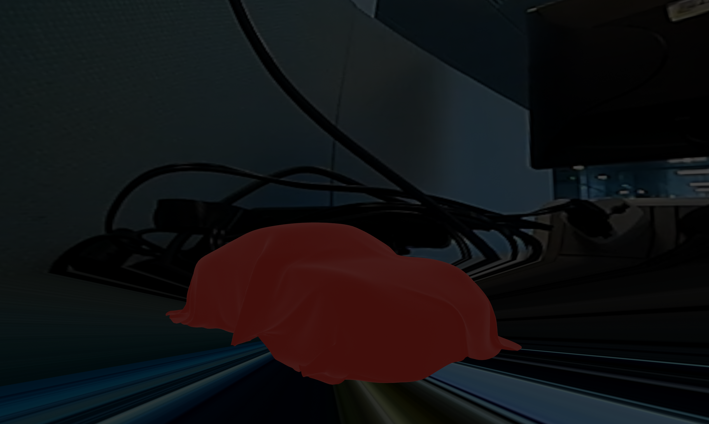

=============
Surround View
=============

This example shows a surround view around a cars base on four camera feed.

API
---
* OpenGL SC 2.0
* OpenGL ES 3.0+

Description
-----------
Surround view example is capable for safety critical environment but running default on OpenGL ES 3.0+ and need user to adjust CMake and switch header to running on OpenGL SC.

The Surround view example shows a car and the surround environment, by using the same camera calibration method of OpenCV, the result in this example could match the visual detection base on OpenCV.
