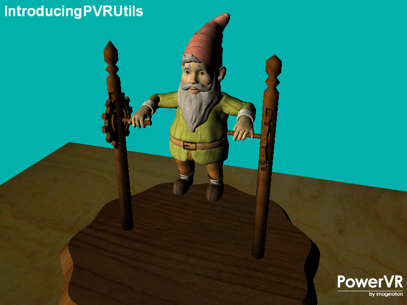

===================
IntroducingPVRUtils
===================

Render a .pod scene using a a simple vertex and fragment shader making use of the PVRUtils library for various utility functions.

Description
-----------
This training course demonstrates how to make the most of the PVRUtils library for handling various api agnostic utility functions such as loading shaders and creating buffers. Various api specific utility functions are also provided such as the OGLES specific EGL context creation and Vulkan swapchain and instance creation helper. The PVRUtils library is also used to display simple text on screen.

APIS
----
* Vulkan
* OpenGL ES 2.0+

Controls
--------
- Quit- Close the application
