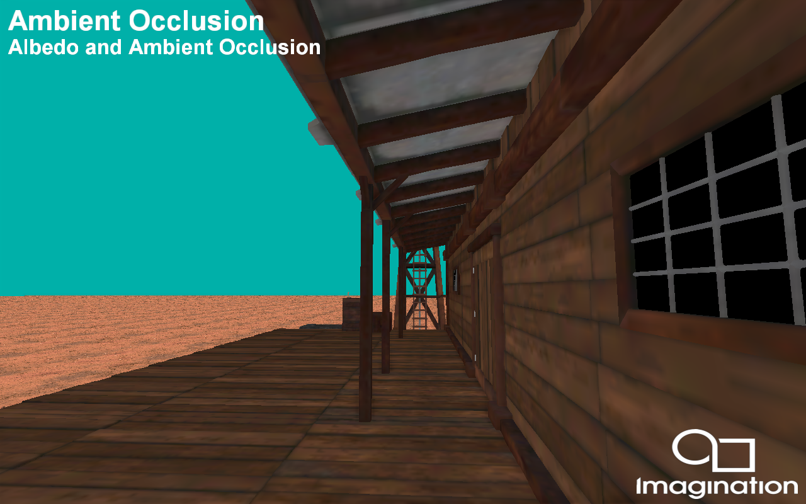

AmbientOcclusion
===============

This example demonstrates an PowerVR optimised implementation of screen space ambient occlusion(SSAO) using a deferred shading pipeline with Pixel Local Storage (PLS), or Subpasses with Transient Attachments (Vulkan).

API
---
* Vulkan

Description
-----------	
Deferred rendering pipelines lend themselves to implementing a SSAO algorithm, because the information required to generate SSAO already exists within the GBuffer. However, ambient occlusion requires a lot of texturing processing, this demo tries to minimise this as much as possible to make the application optimized for mobile. 

After the GBuffer pass has been completed, a series of screen space effects are used to generate the ambient occlusion texture. Since AO algorithms require sampling around the current fragment, separate render passes  need to be used. However, the blurred and finalized ambient occlusion texture is passed to the composition pass via fast on-chip memory via a subpass and a transient lazily allocated image, which is available to the PowerVR architecture. 

Controls
--------
- Action1- Pause or play animation
- Left / Right- Change how the on screen buffer is composited 
- Quit- Close the application