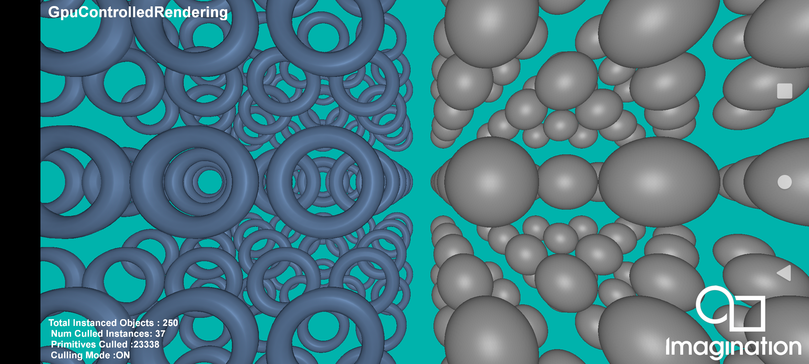

======================
GPUControlledRendering
======================

This example demonstrates GPU controlled rendering technique using the PowerVR Framework.

API
---
* Vulkan

Description
-----------
GPU Controlled or GPU Driven Rendering is a technique used to offload some of the earlier CPU driven calculations such as scene traversal, sorting, and culling to the GPU using indirect drawing and compute shaders. This implementation demonstrates performing early frustrum culling using compute shader and indirect draw. Which allows us to effectively reduce the number of primitives to be processed during our vertex/geometry stages and ultimately reduce the overhead on our TBDR tiler stage.

This technique is used extensively in the modern rendering engines to eliminate the extra overhead during the processing of geometry /tiler stages in the pipeline and resulting in reduced memory footprint, improved efficiency and potentially achieve higher frame rates.

To see performance differences in the Tiler task execution, take a PVRTune capture while toggling the culling mode. 

For the full documentation, see `GPU Controlled Rendering Using Compute & Indirect Drawing <https://docs.imgtec.com/sdk-documentation/html/whitepapers/GPUControlledRendering.html>`__.

Controls
--------
- Touchscreen : Tap  - Toggle Compute Cull ON/OFF
- Mouse : Left Click - Toggle Compute Cull ON/OFF

