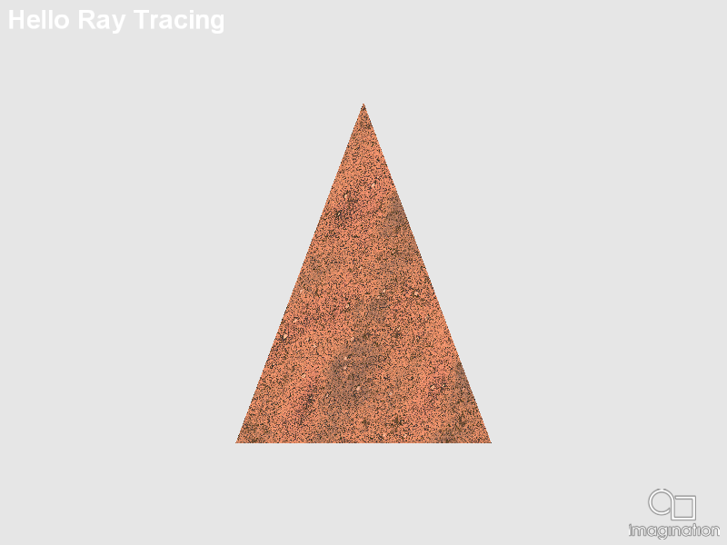

====================
HelloRayTracing
====================

This example demonstrates the basics on how to use the new Vulkan Khronos Ray Tracing extension, to render a triangle on an off-screen render target.

API
---
* Vulkan

Description
-----------

The new Khronos Vulkan Ray Tracing extension, with its Final Specification released officially in December of 2020, allows the usage of ray tracing cores on the GPU to perform hardware accelerated ray tracing.

This opens the GPUs to a new plethora of techniques, some of them 100% render, some of them hybrid rendering, that can be implemented with the Vulkan API.

In this example, the code inside the SDK is exposed to build the basic structures required for ray tracing, (Top and Bottom Level Acceleration Structures and the Shader Binding Table), to ray trace a single 3D triangle.

Controls
--------
