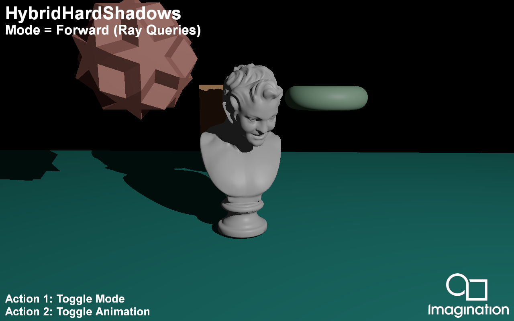

=================
HybridHardShadows
=================

This example demonstrates Ray Traced Hard Shadows using the Vulkan Ray Tracing Pipeline and Ray Queries.

API
---
* Vulkan

Description
-----------	
Shadow rendering in traditional rasterization based pipelines is commonly done via Shadow Maps. While this approach produces acceptable result it has a variety of issues.

Ray Traced shadows do not suffer from these issues and produce pixel perfect shadows. 

In this demo present two methods for integrating Ray Traced Hard Shadows into your rasterized application:

For an application with a Forward Rendering pipeline you can integrate Ray Traced Shadows quite easily by using Ray Queries in your Forward Shading pass with a single ray per pixel.

If your application requires a G-Buffer we also present a Deferred Shaded approach that creates a Ray Tracing Pipeline and traces rays from the positions stored in the G-Buffer to create a visibilty mask which is later used in the 
Deferred Shading pass as visiblity for each pixel. 

Controls
--------
- Action1- Toggle mode
- Action2- Toggle animation
- Quit- Close the application