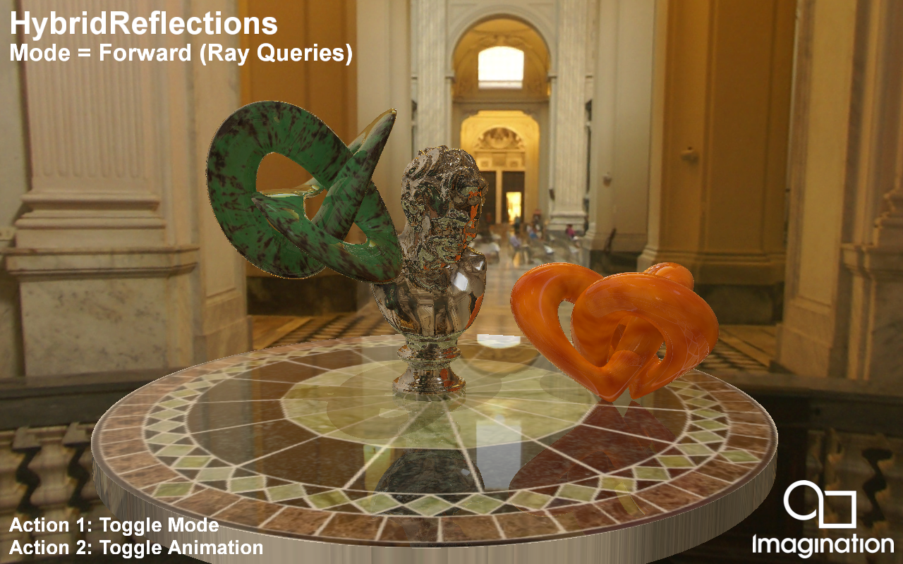

=================
HybridReflections
=================

This example demonstrates Ray Traced Reflections using the Vulkan Ray Tracing Pipeline and Ray Queries.

API
---
* Vulkan

Description
-----------	
Rendering reflections in a rasterization pipeline is quite costly and requires techniques that do not offer perfect results such as Screen Space Reflections or Cubemaps.  

Ray Tracing offers perfect reflections of on and offscreen objects without any of the shortcomings of the earlier techniques. 

In this demo present two methods for integrating Ray Traced Reflections into your rasterized application:

For an application with a Forward Rendering pipeline you can integrate Ray Traced Reflections quite easily by using Ray Queries in your Forward Shading. 
If inter-reflections are required you can trace rays in a loop and accmulate the throughput of each ray similar to a path tracer. 

The final result can be used as a substitute for a pre-filtered environment map, making this a perfect companion to Image Based Lighting. 

If your application requires a G-Buffer we also present a Deferred Shaded approach that creates a Ray Tracing Pipeline and traces rays from the positions stored in the G-Buffer to create a reflection mask which is later used in the 
Deferred Shading pass. Inter-reflections can be handled as using recursive calls to the traceRayEXT() function in the Ray Hit shaders similar to recursive path tracing.  

Controls
--------
- Action1- Toggle mode
- Action2- Toggle animation
- Quit- Close the application