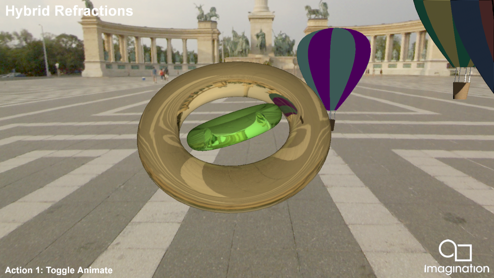

=================
HybridRefractions
=================

This example demonstrates Hybrid Ray Traced Refractions using the Vulkan Ray Tracing Pipeline. It ray traces two dielectric torus meshes, including all the interactions between themselves and the rest of the scene elements and the environment, and rasterizes the remaining three scene elements which have a diffuse Phong shading.

API
---
* Vulkan

Description
-----------	
Rendering refractions in a rasterization pipeline is quite costly and requires techniques that do not offer perfect results such as Screen Space Reflections or Cubemaps.  

Ray Tracing offers perfect refractions of on and offscreen objects without any of the shortcomings of the earlier techniques. 

We also present a Deferred Shaded approach that creates a Ray Tracing Pipeline and traces rays from the positions stored in the G-Buffer to create a refractions mask which is later used in the 
Deferred Shading pass.

Controls
--------
- Action1- Toggle scene elements update
- Quit- Close the application