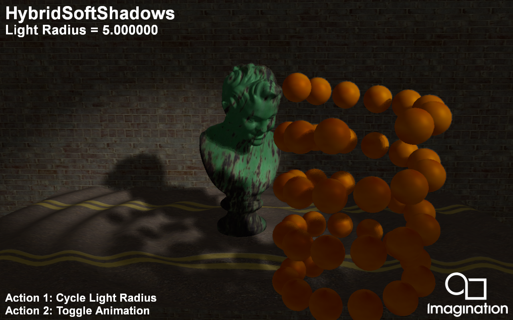

=================
HybridSoftShadows
=================

This example demonstrates Ray Traced Soft Shadows using Vulkan Ray Queries and a simple denoiser.

API
---
* Vulkan

Description
-----------	
In this demo we present a method for generating Soft Shadows using 1-sample-per-pixel (1spp) Ray Tracing within a Deferred Shaded application. 

The ray tracing pass is integrated into the G-Buffer pass and generates a shadow mask using Ray Queries which eliminates the bandwidth cost that would otherwise be present if used with a separate ray tracing pass.

The ray direction is computed using a random number that is based on the world position as to retain image stability when objects are stationary.

A few mip levels for this shadow mask is generated which is used to determine if a pixel belongs to the penumbra region. This prevents the denoiser from being used on every fragment shader invocation.

The actual denoising is performed using a poisson disk blur with random rotations based on world position. The blur radius is determined by the ray hit distance. 
The denoising step itself is integrated into the deferred shading pass, thus minimizing the number of new passes required.

Controls
--------
- Action1- Cycle light radius
- Action2- Toggle animation
- Quit- Close the application