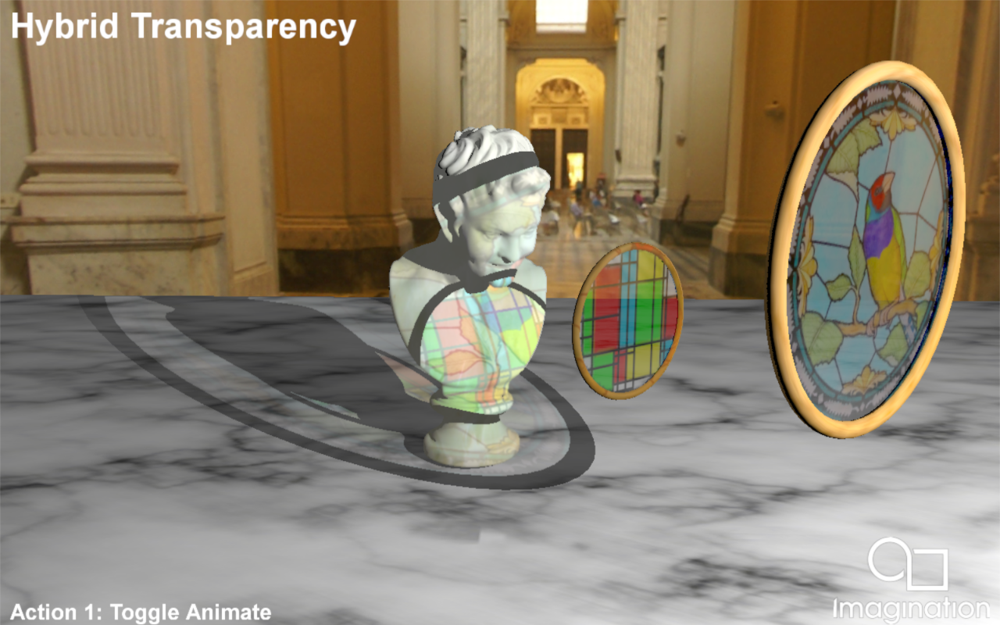

=================
Hybrid Transparency
=================

This example demonstrates Hybrid Ray Traced Transparency using the Vulkan Ray Tracing Pipeline.

API
---
* Vulkan

Description
-----------	
Rendering order independent transparency through ray tracing becomes straighforward applying some OIT techniques like Weighted blended order-independent transparency implemented on this sample.

We also present a Deferred Shaded approach that creates a Ray Tracing Pipeline and traces rays from the positions stored in the G-Buffer to create a transparency mask which is later used in the 
Deferred Shading pass. Two types of rays are dispatched: From every texel in the DS render target that represents an opaque scene element towards the emitter, to add emitter contribution through transparent objects to that opaque scene element, and rays from those scene elements with a transparent material, with ray direction camera -> world position, intersecting other transparent objects until they come across an opaque scene element or the environment.

Controls
--------
- Action1- Toggle scene elements update
- Quit- Close the application