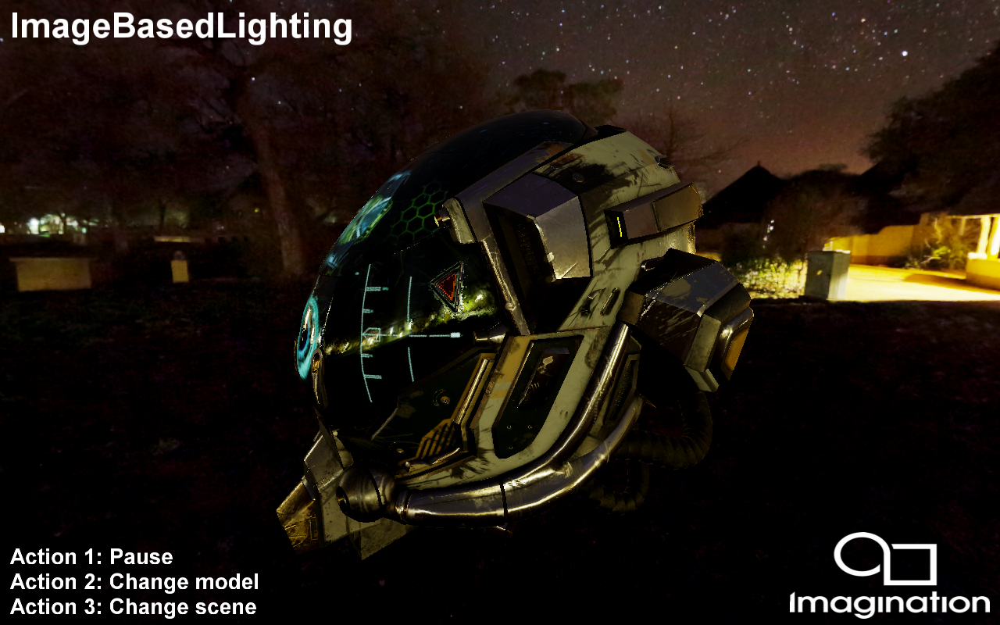
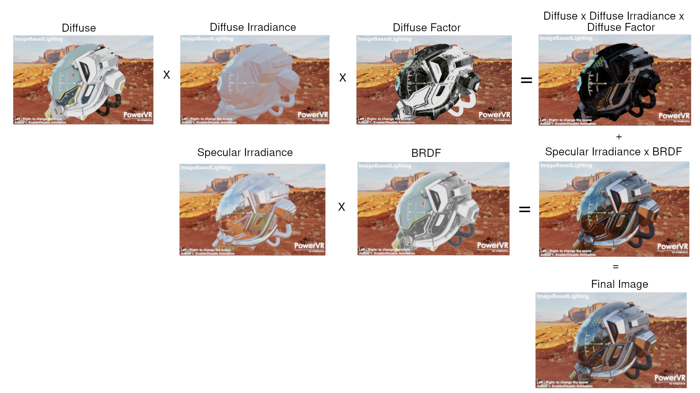

==================
ImageBasedLighting
==================

This example demonstrates Physically Based Rendering (PBR) with Image Based Lighting (IBL). 

Description
-----------
This example has two scenes using Metallic-Roughness PBR workflow

* Helmet: A GLTF model rederered  with different material properties with albedo, metallic roughness and emissive map.

* Spheres, showcasing different metallic and non metallic materials.

IBL: based on https://blog.selfshadow.com/publications/s2013-shading-course/karis/s2013_pbs_epic_notes_v2.pdf

IBL Diffuse: Compute diffuse factor computed from the environment map, using the lambert diffuse BRDF, light colour multiplied by NdotL (normal of the surface and the light direction).
For indirect lighting, NdotL is ignored since the light is coming from all directions, so Diffuse factor = light colour. Every pixels in the environment map is a light source so a given shaded point is lit by many texels from the environment map  because in global illumination a shaded surface is influenced by its surrounding lights. This is pre-computed offline called Irradiance map. 
For this demo Irradiance map is an cube-map which each pixels in each face is averaged, computed by sampling texels for each face over hemisphere. This generated map is an cube-map, in the shader we average the neighbouring texels color for an output fragment and the result is encoded as RGBM texture format to save texture bandwidth.

IBL Specular:
For specular we want the reflection to be crispy when the roughness value is low and get blurry when it is high, because as the roughness increases the reflection gets more blurry. In order to achieve this we have to resolve an integral called radiance integral.

The Equation split into two sums. Each sum can be pre-calculated (Pre-Filtered Environment map and Environment BRDF)

Pre-Filtered Environment map
The first sum is pre-calculated  for different roughness values and stored in the mip-map levels of the cubemap. The environment map is convolved  with CGX distribution using important sampling. 
Specular reflections looks shiny when the roughness values is low and it becomes blurry when the roughness value is high. This is encoded in mip levels. Mip level 0 contains samples for roughness value 0, and the remaining mip levels get blurry for as the roughness value increases to 1.
The samples encoded in this map is the result of the specular BRDF of the environment map. For each pixels in the environment map computes the Cook-Torrentz microfacet BRDF and stores those results.

Evironment BRDF: The second sum includes everything else, it is same as integrating the specular BRDF with solid white environment. This takes two inputs (roughness and cos Θv (view angle)) and two outputs (scale and bias to F0) in the range [0,1]. This is pre-calculated and stored in a 2D look-up texture (2D LUT). The sum of the integration is not specific for an environment therefore the texture can be used for any environment map. The texture need to be stored in 16bit per component format for proper precision and stored as RG1616 texture format.

IBL Layers

APIs
----
* OpenGL ES 3.0+
* Vulkan

Controls
--------
- Quit- Close the application
- Left/ Right to change the scene
- Action1 to pause.
