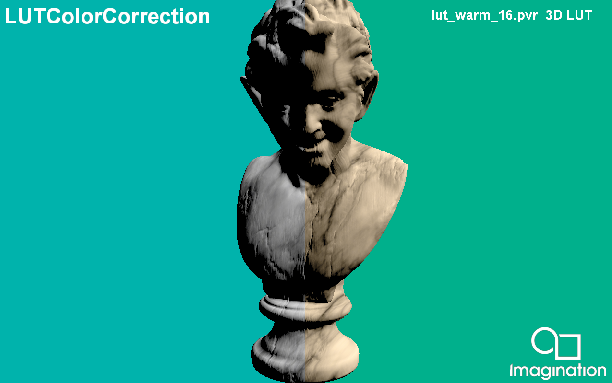

=======
LUTColorCorrection
=======

This example demonstrates how to perform real-time color grading using a 3D Look-Up Table (LUT) in the PowerVR Framework.

API
---
* Vulkan

Description
-----------
Color correction via 3D LUTs is a powerful technique used to achieve specific cinematic looks (such as "warm" or "cool" tones, which are included in this demo) by remapping the colors of a rendered scene. The application renders a 3D model, then creates a 3D texture with colors sampled from the selected lookup texture and applies the color transformation in a post-processing pass.

Controls
--------
- Left/Right Arrows- 		 Cycle through different LUT color presets (Warm, Cool) and 2D/3D LUT Texture.
- Up/Down Arrows- 	 	 Cycle through LUT texture resolutions (16, 32).
- Quit- 			 Close the application
