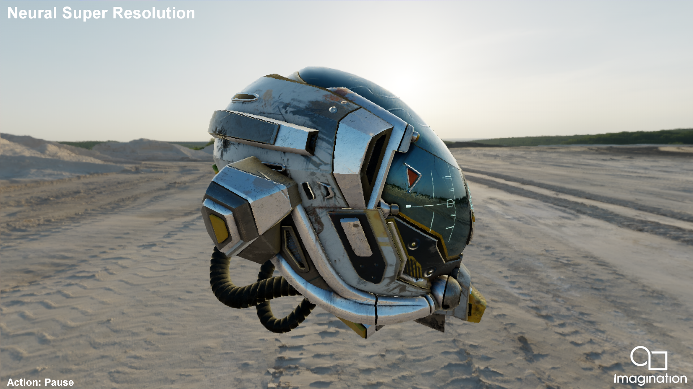

=====================
NeuralSuperResolution
=====================

This example demonstrates how to use the PowerVR Neural Super Resolution upscaler through a compute shader which evaluates the neural network with cooperative matrix Vulkan extension.

API
---
* Vulkan

Description
-----------
The example draws the scene at half resolution and provides to the PVRSuperResolution library the information to apply upscaling (current frame color, motion vectors and depth all at half resolution, and previous frame at upscaled, FullHD resolution). The method initializeSuperResolution() performs all the initialization and resource sharing with the PVRSuperResolution library implementing the Neural Super Resolution upscaler, where image views of all the inputs required by NSR are provided (offscreenColorAttachmentImageView, offscreenMotionVectorAttachmentImageView, offscreenDepthAttachmentImageView, previousFrameResultImageView), their current layouts (inputImageLayout) and the output image views where to store the upscaled images in vectorOutputImageView (in this case, the swapchain images). The SDK sample builds one set of input images per swapchain image to allow having several frames in flight.

NOTE: The sample needs to run at FullHD (1920x1080), otherwise it will exit. Please run with command line arguments -width=1920 -height=1080 -fullscreen=1 It is also possible to run the non-upscaled version of the scene, using native rasterization at FullHD resolution adding the extra parameter -nativeFullScreenRasterization

NOTE: For detailed explanation on the PVRSuperResolution library technique taking care of the upsampling computations and how it is used in this SDK sample, see the documentation https://imgtec.atlassian.net/wiki/x/koBnUw

Controls
--------
- Esc to close the application.
- Action1 (space) to pause.
