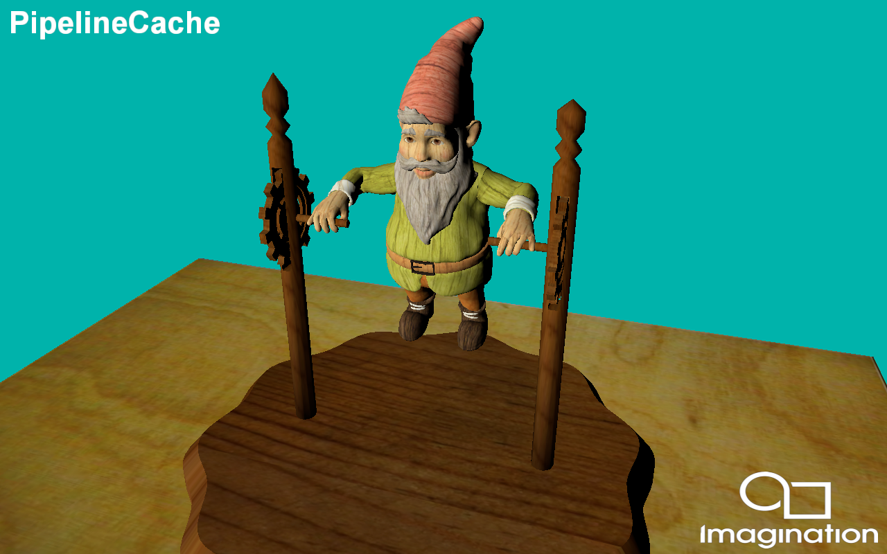

===================
IntroducingPVRUtils
===================

This example renders a ``.pod`` scene using a a simple vertex and fragment shader, making use of the PVRUtils library for various utility functions.

API
---
* Vulkan

Description
-----------
This example demonstrates how Vulkan's Pipeline Cache to store the pipeline data to a binary file to be used in later executions.

Controls
--------
- Quit- Close the application
