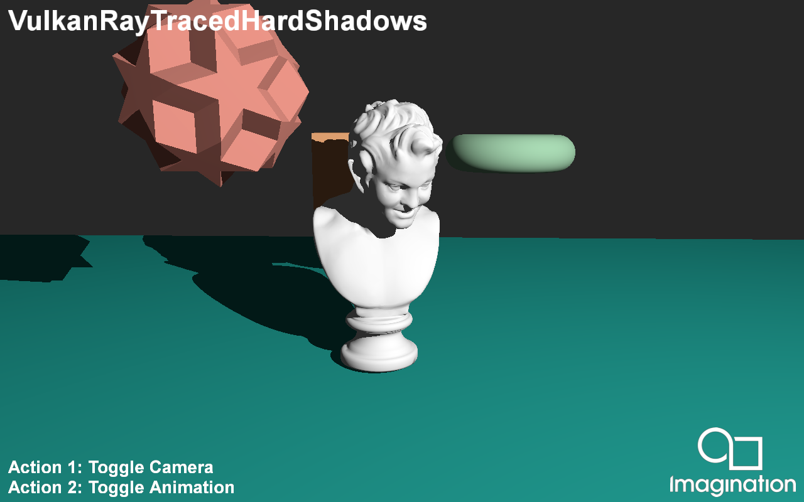

====================
RayTracedHardShadows
====================

This example demonstrates raytraced hard shadows using the Vulkan Raytracing Pipeline Extension.

API
---
* Vulkan

Description
-----------	
Shadow rendering in traditional rasterization based pipelines is commonly done via Shadow Maps. While this approach produces acceptable result, it has a variety of issues. Using the Raytracing pipeline, a lot of these problems can be resolved to produce pixel perfect shadows. 

This demo is fully raytraced which means the only traditional rasterization used is copying the finalised image from the raytracing pipeline to the onscreen framebuffer.

The application starts by producing one ray per pixel, starting at the camera location. These primary rays are then fired into the scene to collide with the scene geometry. If the Primary ray doesn't collide with any geometry it writes the clear color to the image store. When a primary ray collides with scene geometry, the phong lighting component is calculated in a traditional manner. A secondary ray is then launched, starting at the primary collision point, and directed towards the light, if the shadow ray hits any more geometry then the phong lighting is set to 0, else it remains unaffected. To save on ray budget if the phong lighting is calculated to be 0 at the primary ray collision, then a secondary shadow ray is not launched.

Controls
--------
- Action1 - Toggle Camera Movement
- Action2 - Toggle Animation
- Quit - Close the application