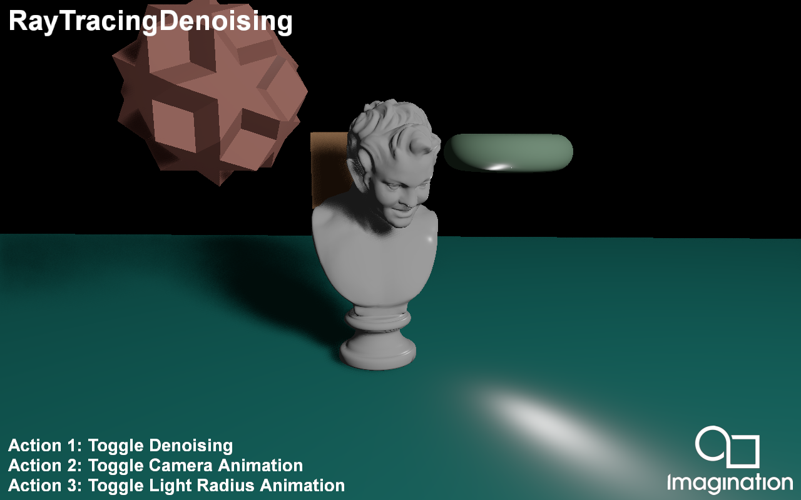

===================
RayTracingDenoising
===================

This example demonstrates denoising Ray Traced Soft Shadows using a combination of temporal and spatial techniques.

API
---
* Vulkan

Description
-----------	
Typical Ray Traced soft shadows requires many rays-per-pixel in order to converge to a noise-free result. 

However, in Real-Time rendering we cannot afford more than a single ray in order to meet the required level of interactivity. 

To combat this, we use denoising techniques to obtain a clean visual output with a low sample count.

In this demo we present a basic denoiser consisting of a temporal and spatial step:

In the Temporal step we accumulate the shadow mask of the previous frame by reprojecting the current pixel into the previous frame. We check if the reprojection is valid using a Plane Distance, Normal and Out of Frame disocclusion check.
To prevent ghosting we compute a neighbourhood mean value from the noisy input and clamp the accumulated value to within 1 standard deviation of the current input sample.
For this to work effectively we require a large wide neighbourhood, however that requires many texture samples. To minimize this, we downsample the noisy input image and compute the neighbourhood using a 3x3 kernel footprint at the 2md mip level, 
where a single texel covers 4x4 texels at the base mip level.

Finally in the Spatial denoising step, we perform a wide edge-aware poisson disc blur with 8 samples to clean up any remaining noise. Since we have a wide kernel radius with a low number of samples, we rotate all the samples for each pixel using 
Interleaved Gradient Noise in order to avoid any banding artefacts. 

Controls
--------
- Action1- Toggle Denoising
- Action2- Toggle Camera Animation
- Action3- Toggle Light Radius
- Quit- Close the application