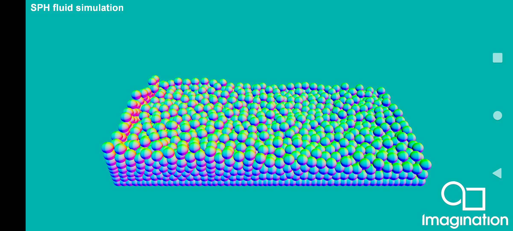
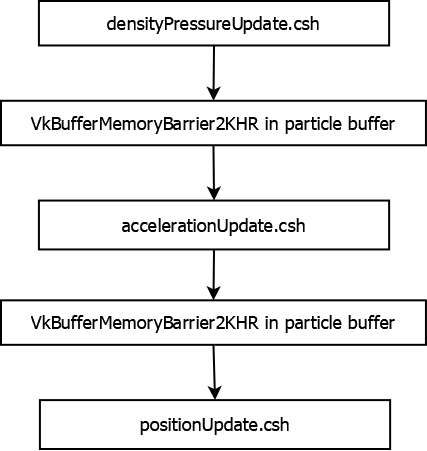

==================
SPHFluidSimulation
==================

This example demonstrates how to use the Vulkan extension VK_KHR_synchronization2 ( https://registry.khronos.org/vulkan/specs/1.3-extensions/man/html/VK_KHR_synchronization2.html ) through a compute intensive context where a fluid is simulated using Smoothed-particle Hydrodynamics (SPH).

API
---
* Vulkan

Description
-----------

The new Vulkan extension VK_KHR_synchronization2 incorporates new APIs (vkCmdPipelineBarrier2KHR, vkCmdResetEvent2KHR, vkCmdSetEvent2KHR, vkCmdWaitEvents2KHR, vkCmdWriteTimestamp2KHR,  vkQueueSubmit2KHR), structs (VkBufferMemoryBarrier2KHR, VkCommandBufferSubmitInfoKHR, VkDependencyInfoKHR, VkImageMemoryBarrier2KHR, VkSemaphoreSubmitInfoKHR, VkSubmitInfo2KHR) and enums (VkAccessFlagBits2KHR, VkPipelineStageFlagBits2KHR, VkSubmitFlagBitsKHR) allowing a more fine-grained control for each type of barrier. As an example, if we compare vkCmdPipelineBarrier (https://registry.khronos.org/vulkan/specs/1.3-extensions/man/html/vkCmdPipelineBarrier.html) and vkCmdPipelineBarrier2 (https://registry.khronos.org/vulkan/specs/1.3-extensions/man/html/vkCmdPipelineBarrier2KHR.html) we can see how most of the parameters have been wrapped into a VkDependencyInfo struct, which although it still holds the information about memory, buffer and image barriers, it does no longer have information about pipeline stage (parameters srcStageMask and dstStageMask of type VkPipelineStageFlags), which are now specified in each VkBufferMemoryBarrier2 and VkImageMemoryBarrier2 struct.

This example implements a small SPH fluid simulation based on the paper "Particle-Based Fluid Simulation for Interactive Applications" (Matthias Müller, David Charypar and Markus Gross), following the kernels explained and specified in the Algorithm 1 from "Accelerating Fluids Simulation Using SPH and Implementation on GPU" (Aditya Hendra) to compute the density, pressure, and pressure and viscosity forces to simulate the particles. In the example code, the buildParticleBuffer method implements the code to build the particle buffer and its initial content, the method buildParticleSimulationSettingsBuffer implements the structured buffer view with all the scene settings needed for the particle simulation to be done, including all the fluid parameters like rest density, stiffness, viscosity or gravity. The method buildSphereDrawingPipeline implements the code to draw the particles with a single instanced draw call, using as vertex input binding ID 0 the particle mesh information, and as vertex input binding ID 1 the position field of the particle buffer built in the buildParticleBuffer method. The particle simulation itself is done in three compute dispatches, with the first one corresponding to the densityPressureUpdate.csh shader where the density and pressure of each particle is computed, then the accelerationUpdate.csh shader where the pressure and viscosity forces acting on each particle determining its acceleration, and lastly the positionUpdate.csh shader, where each particle's position is updated based on the acceleration computed on the previous stage. See each shader's source code and comments for a better understanding of the algorithm. The implementation does not have any spatial acceleration, common in this type of simulations, to lower the computational cost of finding those particles within the area of effect of the particle or "core radius". 

The usage of the VK_KHR_synchronization2 extension is done in the recordComputeCommandBuffer method, where a call to vkCmdPipelineBarrier2KHR is done inside the call to pipelineBarrier2, adding a buffer memory barrier for the buffer containing all the particles simulation information. This makes sure all the shader writes from the previous compute dispatch are made visible to the next compute dispatch, needed to correctly perform the particle simulation, in the same command buffer submitted to a compute queue.

Due to the fragility of the simulation and the stability required, the particle simulation delta time is clamped and detached from the FPS.

Controls
--------
- Quit- Close the application

