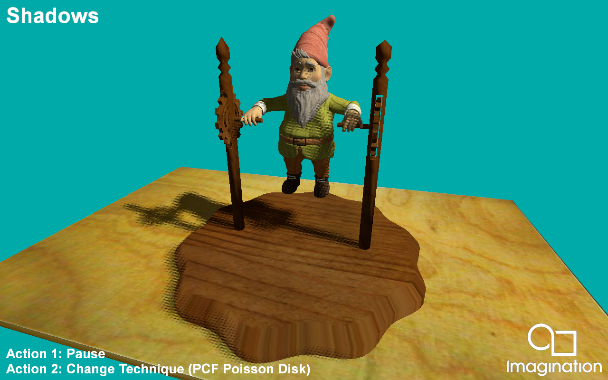

=================
Shadows
=================

This example demonstrates a variety of techniques for rendering shadows on mobile devices using shadow maps.

API
---
* Vulkan

Description
-----------	
This sample demonstrates various shadow mapping techniques such as Percentage Closer Filtering and Variance Shadow Maps.

For PCF we present a poisson disc sampled approach that gives soft, yet slightly noisy results fit for mobile that only use 8 samples with random rotations using Interleaved Gradient Noise.
There is also a technique created by Thekla Inc. for use in their game 'The Witness' which uses hardware PCF capabilities to archieve a soft result using minimal samples.

For Variance Shadow Maps we include the basic VSM implementation using depth and depth squared stored in the shadow map. 
We also include two Exponential Variance Shadow Map implementations that improve upon the VSM technique by reducing light bleed at the cost of using more memory, in the case of EVSM4. 

Controls
--------
- Action1- Pause Camera Animation
- Action2- Cycle between techniques 
- Quit- Close the application