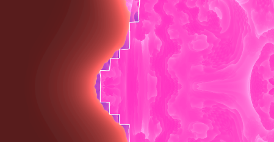

# Vulkan Subgroups - Explanation Document

## Introduction To Subgroups

This program is a demo to show the Vulkan Subgroup features - they were added into Vulkan core in 1.1 and as such the demo targets Vulkan 1.1. A swapchain output was requested for this demo, to give visual feedback on the subgroup features being utilised. As a result the demo uses a compute shader to write to an output texture, which is then copied to the swapchain using a graphics pipeline. To provide the user of visual feedback of which subgroup features are enabled, the image generated uses a different colour pallet.

Vulkan subgroups focus on mapping the execution of compute shaders closer to the hardware. Subgroups should represent a physical execution unit on the hardware, which then allows more efficient synchronisation and memory sharing across the subgroup compared to when executing across a workgroup. For example, when using the `gl_subgroupBarrier()` built in; the user can force threads to synchronise across the subgroup, which is far more efficient than syncing across an entire workgroup.  

One of the major differences between subgroups and workgroups is that by default you can't control the execution shape of a subgroup, instead the threads are usually allocated in order. Since the subgroup sizes are intended to map directly to hardware if your workgroup size is not a multiple of the subgroup size, then you will have thread invocations left unutilised.

## Vulkan Subgroups Extensions Covered

This demo covers the following extensions : subgroup basic, subgroup vote, subgroup ballot, subgroup arithmetic.

### Subgroup Basic

This extension provides the majority of the subgroup built in shader variables, mainly the subgroup equivalent of the workgroup related built-ins for example : `gl_subgroupBarrier`, `gl_SubgroupID`, `gl_NumSubgroups` etc. This extension is the bare minimum to start using subgroup control flow in your compute shaders 

The standout built in function is `gl_subgroupElect` which returns true for only one invocation in the subgroup, allowing the user to elect just one subgroup to do tasks.

### Subgroup Vote

This is one of the more simple extensions, it allows for subgroups to communicate boolean values, there are three different built in shader functions `subgroupAll`, `subgroupAny`, and `subgroupAllEqual`. `subgroupAll` returns true if for every single thread in the subgroup, the passed value is true. `subgroupAny` returns true if any of the threads in the subgroup has value set to true. Finally `subgroupAllEqual` can take any value and returns true if the value is equal for all threads in the subgroup. 

### Subgroup Ballot

Ballot provides a more advanced feature set than subgroup vote. Allowing each subgroup to set one bit in a unsigned vec4. That unsigned vec4 is then made visible to all threads in the subgroup, and can then be interrogated to count how many thread invocations voted either way. This is done primarily through the `subgroupBallot` function, but it has a variety of different versions.

Another useful feature that comes with subgroup ballot is the ability to broadcast arbitrary values across a subgroup without a memory barrier. either through `subgroupBroadcast` which requires an invocation id to be passed as a parameter or you can use `subgroupBroadcastFirst` 

### Subgroup Arithmetic 

This extension is a lot easier to explain, it allows users to perform mathematical operations on arbitrary parameters passed to the subgroup functions. They also add inclusive and exclusive versions of the mathematical functions. For example `subgroupExclusiveAdd` returns the exclusive scan summation of the parameter passed.

## Compute Shader Summary

This will now cover what the compute shader is trying to compute. Since the swapchain is a required output, a raymarching experiment was chosen. The object being ray marched is called the Mandlebulb, a 3d equivalent of the Mandelbrot set. 

How does a raymarch work? First, each pixel is assigned in the output image is assigned to one thread invocation in the compute shader; which then represents a ray. That ray then checks how far away it is from every object in the scene (in this case just the Mandlebulb). If the distance to the scene is really small, then we consider a hit against the scene. If the distance is too large, then we consider the ray a miss. We can calculate a "glow" effect for free, by counting the number of near misses.

In order for a raymarch to work, we need to be able to be able to calculate the distance from an arbitrary point to the surface of the Mandlebulb, this is done through an estimate known as the distance estimator.

The Mandlebulb comes from holomorphic dynamics, which is the study of continuously iterating functions in complex spaces. In this case we are trying to find all of the points for which the iteration of a function either remains trapped, or escapes to infinity.

Or in simpler words does the following sequence become infinity:
$$
z_{n+1} = z_{n}^{8} + c
$$
Where `z` is a complex number and `c` is a constant complex number representing the point which we are evaluating the distance of. There's some rather complicated maths in deriving if this sequence tends to infinity, but we use the following code algorithm :

```glsl
// Gets the distance from the point to the object. This will be for a sphere at center
float DistanceEstimate(vec3 p)
{
	// Set some initial values for iteration process used to estimate the distance
	vec3 z = p;
	float dr = 1.0;
	float r = 0.0;

	// How do we tell if a point is inside of the mandlebulb?
	// The mandelbulb comes from holomorphic dynamics, we want to test if a point tend to infinity or if it remains trapped
	// after repeated applications of z_n+1 = (z_n)^8 + c where c is the point passed to this function
	for (int i = 0; i < 5; i++)
	{
		// Mandelbulb has a radius of 1.25, so if r is greater than 1.25 the point escapes to infinity
		// and we have an accurate enough of a distance
		r = length(z);
		if (r > 1.25) break;

		// convert z to polar coordinates
		float theta = acos(z.z / r);
		float phi = atan(z.y / z.x);

		// Estimate the derivative at the current point for the distance estimator
		// (dr_n+1)/dz = 8 (dr_n)^7 + 1
		dr = pow(r, 7.0) * 8.0 * dr + 1.0;

		// Raise current point to the power of 8, which in complex plane is multiplying angles by 8
		// and raising the scalar radius to the power of 8
		float zr = pow(r, 8.0);
		theta = theta * 8.0;
		phi = phi * 8.0;

		// convert z back to carteasian coordinates
		z = zr * vec3(sin(theta) * cos(phi), sin(phi) * sin(theta), cos(theta));

		// Add our starting point back to the value of z_n+1.
		z += p;
	}

	return 0.5 * log(r) * r / dr;
}
```

## Utilising Subgroups

How does this application make decent use of each of the different subgroup features? Mostly they have been used for either small aesthetic changes or slight optimisations in the "ray generation" part of the compute shader, or just showing the user how to make use of the subgroup control flows.

### Calculating Invocation Count

The demo needs to calculate how many thread invocations are being used globally, so that the image store coordinates can be normalised between 0 and 1. If the subgroup basic feature is enabled then the one thread can be elected to perform the calculation. Then if ballot is enabled, that value cam be broadcasted across the subgroup, or else we have to perform a subgroup memory barrier.

### Skipping Ray Marches

It can be understood that performing the raymarch is expensive! So where possible, we want to be able to skip it. We know that the Mandlebulb has a fixed radius and can be bounded within a sphere, we also know that it is centred in the output image. So if the screenspace coordinates are within a certain radius of the centre of the screen, then we can take a vote to skip.

In subgroup vote we skip the raymarch only if every single thread in the subgroup has voted to skip. However, in ballot we make the entire subgroup skip when roughly half of the invocations in that subgroup voted to skip. This ensures that every thread in the subgroup either performs the ray march, or they all skip. This ensures that voting to skip does not add any branching inside the subgroup, and thread invocations inside the subgroup remain active.

### Highlighting Subgroups

Finally a visual effect, it can be hard to tell where exactly a hit has occurred, and which pixels just contains a lot of near misses and thus has a large glow contribution. Lots of near misses can be expensive, so we can highlight which subgroups have contained a hit. This also has the side effect of letting the users visually see the subgroups and their boundaries. 

We can take the minimum of all the hit counter in the subgroup, cast it into a bool, and then cast that back into a float. That will then result in 0 if the subgroup didn't have any hits, and 1 if the subgroup did. Using that information we can then use a branchless approach to adding an additional highlight 

```glsl
// Highlight the subgroups that have had at least one hit
color += float(bool(subgroupMin(hitCount))) * vec3(1.0, 0.0, 0.0);
```



## Specialisation Constants

How does the program control which features are enabled? Rewriting a different shader for every combination of subgroup features would take forever! So we want to avoid that, and instead use one shader that has modules that can be turned on and off. 

But we cannot use uniforms, as this would introduce extra ifs, and although it wouldn't introduce dynamic branching for that frame because the value would be the same for every single thread, it would introduce extra cycle counts performing those comparisons. This is where specialisation constants come in

Specialisation constants are values that are constant in the SPIRV shader code, but they have yet to have a value set, the value is set a pipeline creation time. At which point, any if statements dependant on those constants can be optimised out by the driver. 

Specialisation constants are identified in the GLSL code by the following layout qualifiers:

```glsl
// Pass which subgroup functionality is being used as a series of specialisation constants
layout(constant_id = 2) const bool SUBGROUP_FEATURE_BASIC = false;
layout(constant_id = 3) const bool SUBGROUP_FEATURE_VOTE = false;
layout(constant_id = 4) const bool SUBGROUP_FEATURE_BALLOT = false;
layout(constant_id = 5) const bool SUBGROUP_FEATURE_ARITHMETIC = false;
```

The values are then set in the pipeline creation info through the following sdk code:

```c++
pipeDesc.computeShader.setShaderConstant(2, pvrvk::ShaderConstantInfo(2, &subgroupBasic, sizeof(bool)));
pipeDesc.computeShader.setShaderConstant(3, pvrvk::ShaderConstantInfo(3, &subgroupVote, sizeof(bool)));
pipeDesc.computeShader.setShaderConstant(4, pvrvk::ShaderConstantInfo(4, &subgroupBallot, sizeof(bool)));
pipeDesc.computeShader.setShaderConstant(5, pvrvk::ShaderConstantInfo(5, &subgroupArithmetic, sizeof(bool)));
```

As a side note, the specialisation constants also allow us to dynamically set the workgroup dimensions at compute pipeline compile time, which then allows the application to change workgroup dimensions depending on the command line arguments passed.