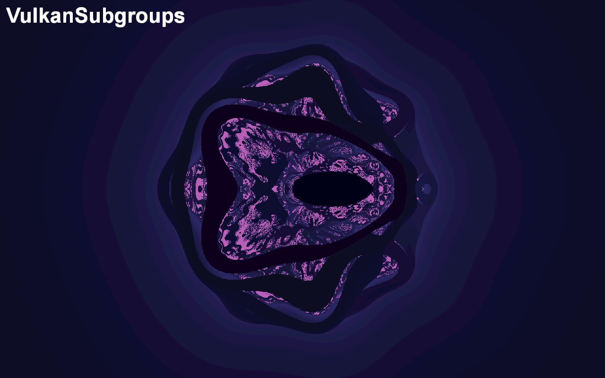

VulkanSubgroups
===============

Shows how to make use of numerous GLSL subgroup extensions in order to
gain more fine grained control over the execution of a compute pipeline.

API
---

-  Vulkan

Description
-----------

Workgroups are segmented into subgroups, and therefore when running a
compute shader, the workgroup sizes should be a scalar multiple of the
subgroup size supported by the hardware. Vulkan supports numerous
subgroup extensions for GLSL. These allow for efficient memory and
processor synchronisations across subgroups. This demo shows users some
of the features available in the following extensions.

1. GL_KHR_shader_subgroup_basic

2. GL_KHR_shader_subgroup_vote

3. GL_KHR_shader_subgroup_ballot

4. GL_KHR_shader_subgroup_arithmetic

The user can then select which subgroup functionalities they wish to
enable, either through a demo menu, or by passing command line
paramaters.

NOTE: Currently on PowerVR Rogue architecture this functionality is supported with a 
subgroup size of just 1. This feature is fully supported on our next generation 
of GPU cores, Volcanic.

Controls
--------

-  Quit : Close the application

-  Action 1 : Open or close the compute pipeline selection menu

-  Compute Pipeline Selection Menu:

   |  Up/Down : Move the cursor up or down
   |  Left : Turn the selected feature off
   |  Right : Turn the selected feature on

## Command Line Arguments

The demos initial settings can be controlled by a series of command line arguments.

* `-texWidth=N` Sets the offscreen texture width to N pixels wide.
* `-texHeight=N` Sets the offscreen texture height to N pixels tall.
* `-scale=N.n` If the user has not specified an offscreen texture size explicitly, then the offscreen texture size will be set to a floating point multiple of the onscreen texture size. If not set, the application defaults to 0.5.
* `-wgWidth=N` Sets the workgroup width of the dispatched compute pipeline, if not specified the application attempts to make a best guess.
* `-wgHeight=N` Sets the workgroup height of the dispatched compute pipeline, if not specified the application attempts to make a best guess.
* `-Subgroup_Basic` Enabled the subgroup basic extension by default when the application first launches.
* `-Subgroup_Vote` Enables the subgroup vote extension by default when the application first launches.
* `-Subgroup_Ballot` Enables the subgroup ballot extension by default when the application first launches.
* `-Subgroup_Arithmetic` Enables the subgroup arithmetic extension by default when the application first launches.
