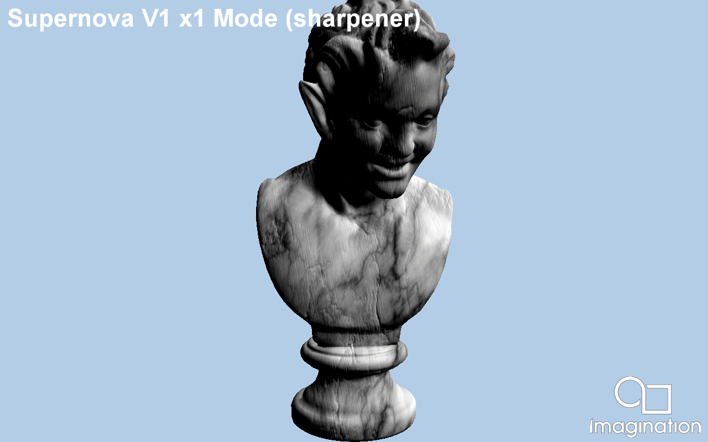

=========
Supernova
=========

This example implements the "Supernova V1 Mode 1X sharpener" and "Supernova V1 Mode 2X spatial upscaler" techniques from the PVRSuperResolution library. Please read the library documentation, present in framework/PVRSuperResolution, for more information on both techniques.

API
---
* Vulkan

Description
-----------
Supernova V1 Mode 1X sharpener: This simple sharpener algorithm requiring only a colour input, which has applied a Colour Conversion Matrix to transform RGB colour onto YUV on one postprocessing pass. Then a second postprocessing pass applies a sharpening kernel, with the results converted back from YUV onto RGB and outputted.

Supernova V1 Mode 2X spatial upscaler: This upscaler algorithm follows a spatial approach, requiring only a colour input image at half resolution (960x540), which is converted to YUV colour space in a postprocessing pass. Then a set of convolutions are applied to the image in another postprocessing pass, generating the final new image at FullHD resolution (1920x1080). Finally, the image is converted back from YUV colour space to RGB in a third and last postprocessing pass. It only requires an RGB input at half resolution (960x540) from the scene, to generate a FullHD output.

NOTE: Run with -imageOutput image.pvr to use an image as input for sharpening or upscaling instead of the scene drawn by the SDK sample.

Controls
--------
- Tap to screen to change between the techniques implemented.
