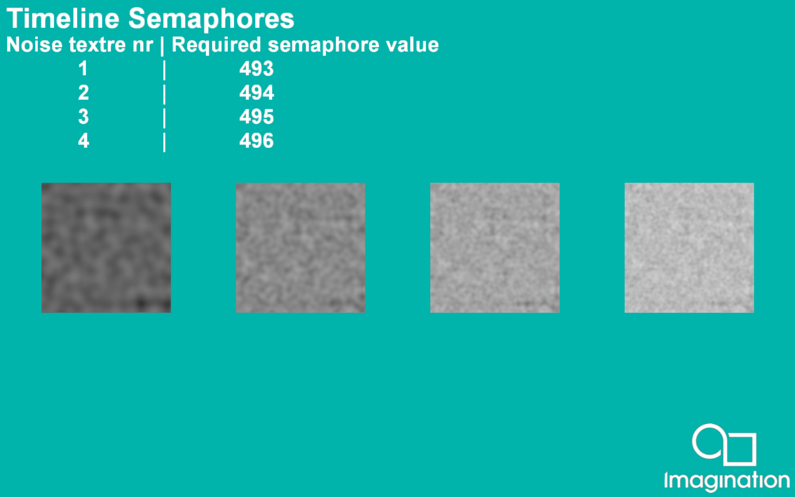

===================
Timeline Semaphores
===================

This example demonstrates how to use timeline semaphores in the PVR framework.

API
---
* Vulkan

Description
-----------
A timeline semaphore is a synchronization primitive introduced in Vulkan 1.2. It uses an integer value instead of a binary one, like a traditional semaphore. 

In this app, timeline semaphores are used to synchronize between dispatches of compute shader. The app creates layered noise texture and displays it on screen.

Controls
--------
- Quit- Close the application

